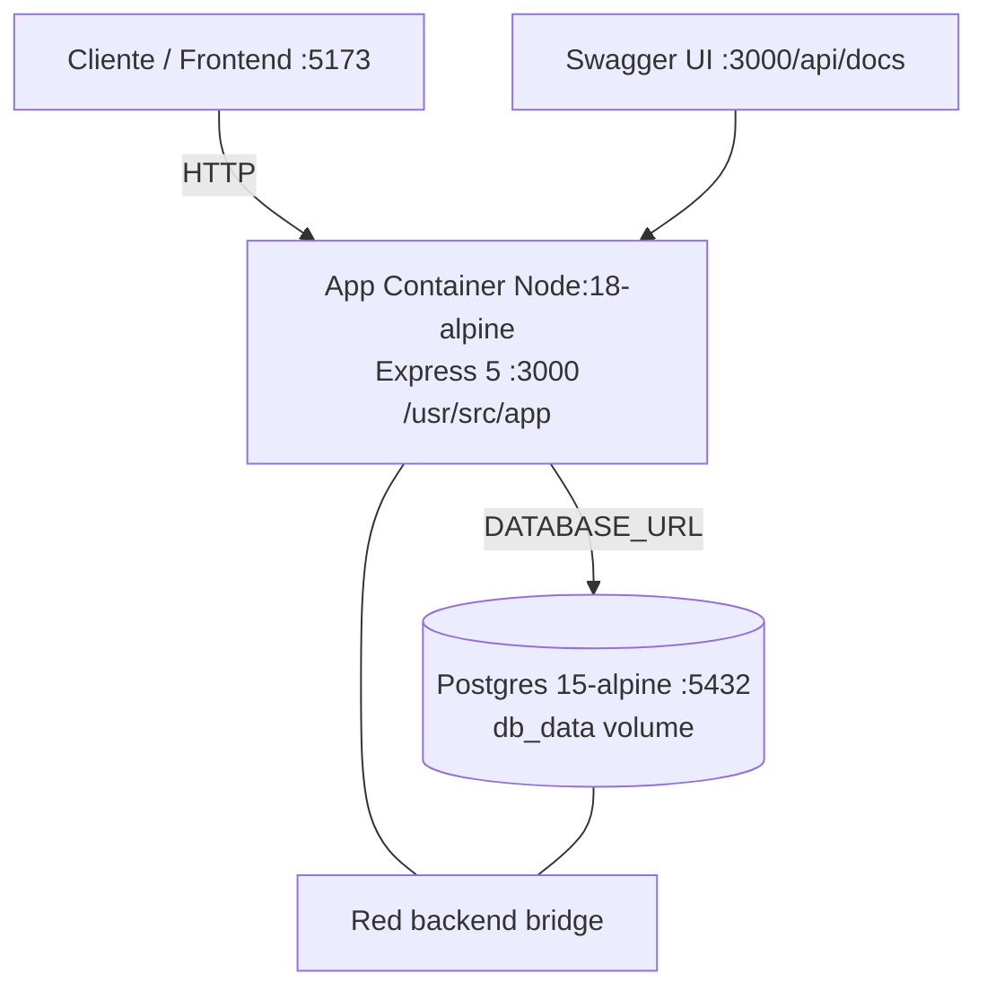

# Documento de Diseño de Software — RiwiMediCare Plus
### Norma de Competencia: 220501095 — Diseñar la solución de software de acuerdo con procedimientos y requisitos técnicos
**Coder:** Manuel Andres Vasquez Mendoza | **Clan:** NODEJS AM | **Fecha:** 01/09/2026
**Repositorio:** https://github.com/manulzweb/RiwiMediCare-Plus | **Stack:** Node.js 18+ / Express 5 / TypeScript strict / PostgreSQL 15 / Sequelize 6 / JWT / Swagger / Docker

---

## 1. Introducción del Sistema

**RiwiMediCare Plus** es una API REST para la gestión del ciclo de vida de solicitudes de abastecimiento de medicamentos. Resuelve la distribución de insumos médicos entre **Clínicas** (solicitantes) y **Almacenes/Bodegas** (proveedores) controlando el inventario de **Medicamentos** y trazando cada **Solicitud (SupplyRequest)** desde su creación hasta entrega.

El sistema nace como **Prueba de Desempeño Módulo 5.2 Node.js** y aplica principios SOLID, DRY, KISS, YAGNI, con arquitectura en capas (Routes → Controllers → Services → Repositories → Models → DB).

**Objetivo General:** Proveer una plataforma centralizada, segura y auditada que garantice trazabilidad, control de stock y separación de roles para el abastecimiento hospitalario.

Swagger UI disponible en `http://localhost:3000/api/docs`. Seed inicial sin autenticación vía `POST /api/v1/seed/upload` (Multer memoryStorage).

## 2. Descripción del Problema a Resolver

**Situación actual:** Clínicas registran pedidos de medicamentos por WhatsApp/correo/excel, sin control de inventario, sin trazabilidad y con riesgo de duplicar NITs, pedir medicamentos de bodega equivocada o exceder stock.

**Problemas identificados:**
- No hay validación de existencia de clínica/medicamento/almacén (errores 404 no controlados).
- No hay validación de stock ni de correspondencia `medicine.warehouseId == request.warehouseId` → pedidos imposibles.
- Cantidades inválidas (≤0) y estados no controlados.
- Gestión manual de usuarios sin roles → cualquiera puede borrar clínicas.
- Borrado físico pierde historia clínica/auditoría.
- Despliegue manual sin contenedores ni backup.

**Solución propuesta:** API REST con autenticación JWT + RBAC, validaciones de negocio (Zod + middlewares dedicados), borrado lógico `paranoid:true`, y despliegue Docker con backup `pg_dump`.

## 3. Objetivos del Sistema

### 3.1 Objetivo General
Desarrollar una API REST segura, escalable y documentada que gestione entidades Clínica, Almacén, Medicamento y Solicitud con control de inventario y flujo de estados.

### 3.2 Objetivos Específicos
1.  Autenticar usuarios con JWT HS256 (`{id,email,role,sub,type:"access"}`) y proteger rutas (401 sin token, 403 rol insuficiente).
2.  Implementar CRUD completo con borrado lógico y validación de NIT duplicado (409) y código de medicamento/almacén.
3.  Validar reglas de negocio: cantidad ≥1, stock suficiente, warehouse-medicine match, estados PENDING→APPROVED→DISPATCHED→DELIVERED (y REJECTED/CANCELLED).
4.  Proveer seed transaccional (warehouses→clinics→medicines→users con bcrypt hash) y backup `backup.sql`.
5.  Documentar con Swagger JSDoc y cubrir >40% con Jest + ts-jest (51 tests).
6.  Containerizar con Docker/Compose y aplicar buenas prácticas (Conventional Commits, GitFlow main/develop/feature/*).

## 4. Actores y Roles del Sistema

| Actor | Rol en BD | Descripción | Permisos |
|-------|-----------|-------------|----------|
| **Administrador** | `ADMIN` | Gestiona catálogo y usuarios, auditoría | CRUD Clínicas, Almacenes, Medicamentos, Solicitudes (todos los endpoints). Único que puede `DELETE` y `PUT` almacenes/medicinas. |
| **Gestor de Solicitudes** | `REQUEST_MANAGER` | Operativo de clínica que crea y mueve solicitudes | `POST /requests`, `PATCH /requests/:id/status`, `GET /requests*`. No puede crear/editar clínicas/almacenes/medicinas. |
| **Sistema (Seed)** | — | Carga inicial sin JWT | `POST /api/v1/seed/upload` con Multer JSON, transacción Sequelize. |
| **Usuario no autenticado** | — | Público | Solo `POST /auth/register` y `POST /auth/login`. |

Diagrama de casos de uso en documento 02.

## 5. Requisitos

### 5.1 Requisitos Funcionales (RF)
| ID | Requisito | Prioridad | Endpoint |
|----|-----------|-----------|----------|
| RF01 | Registrar/Login usuarios con validación Zod y hash bcrypt (hooks beforeCreate/beforeUpdate) | Alta | POST /api/v1/auth/register, /login |
| RF02 | CRUD Clínicas con NIT único (checkNit.middleware) | Alta | GET/POST/PUT/DELETE /api/v1/clinics |
| RF03 | CRUD Almacenes con código único | Alta | /api/v1/warehouses |
| RF04 | CRUD Medicamentos asociados a Almacén (warehouseId FK) | Alta | /api/v1/medicines |
| RF05 | Crear Solicitud validando existencia (ensure*Exists), cantidad>0, stock, warehouse-match | Alta | POST /api/v1/requests |
| RF06 | Cambiar estado de solicitud con máquina de estados case-insensitive (PENDING, APPROVED...) | Alta | PATCH /api/v1/requests/:id/status |
| RF07 | Consultar solicitudes: todas, activas, por clínica, por ID | Media | GET /api/v1/requests, /active, /clinic/:clinicId, /:id |
| RF08 | Borrado lógico (paranoid + isDeleted + deleted_at) | Alta | DELETE /requests/:id etc. |
| RF09 | Carga masiva inicial JSON vía Multer (5MB, solo .json, memoryStorage) | Media | POST /api/v1/seed/upload |
| RF10 | Documentación Swagger en /api/docs (bearerAuth) | Media | GET /api/docs |

### 5.2 Requisitos No Funcionales (RNF)
| ID | Categoría | Requisito | Métrica |
|----|-----------|-----------|---------|
| RNF01 | Seguridad | JWT HS256 con access 15m / refresh 7d, bcrypt 12 rounds, Helmet, CORS, Rate-Limit 100 req/min, validación Zod | OWASP Top 10 |
| RNF02 | Disponibilidad | Docker Compose con restart:always para db, healthcheck implícito | 99% uptime local |
| RNF03 | Rendimiento | Paginación implícita, índices en NIT/code/email, Sequelize underscored | <200ms p95 en CRUD |
| RNF04 | Mantenibilidad | TypeScript strict:true sin any, ESLint flat + Prettier, SOLID SRP 30-40 líneas, DRY | 43% coverage (6 suites, 51 tests) |
| RNF05 | Portabilidad | Docker 20-alpine, Node 18 ESM type:module, volumen db_data, red backend | 1 comando `docker-compose up` |
| RNF06 | Auditabilidad | timestamps true, paranoid true, isDeleted flag, deletedAt, createdById en requests | Trazabilidad completa |
| RNF07 | Usabilidad | Swagger UI interactivo, mensajes de error JSON normalizados (401/403/400/404/409) | DX |
| RNF08 | Backup | pg_dump --clean --if-exists (123K) + seed-real.json (3 users,3 clinics,2 warehouses,4 medicines) | Recuperación <2 min |

## 6. Arquitectura de la Solución

### 6.1 Arquitectura Lógica - En Capas (Layered) + Repository Pattern + DI por constructor

```
Cliente (Swagger/Postman/Frontend :5173) 
   ↓ HTTP + JWT Bearer
Routes (Express Router + middlewares chain: auth 401 → role 403 → validate 400 → service 409/404 → controller 200)
   ↓ DTO (Zod schemas)
Controllers (auth, clinic, warehouse, medicine, request - 30 líneas, delegan)
   ↓
Services (auth.service, clinic.service, warehouse.service, medicine.service, request.service, seed.service + interfaces/*.interface.ts)
   ↓
Repositories (clinic.repository, etc. + interfaces)
   ↓
Models (Sequelize Model + paranoid + hooks)
   ↓
PostgreSQL 15 (table: users, clinics, warehouses, medicines, supply_requests) via sequelize.authenticate().sync({alter:true})
```

**Patrones aplicados:** Bouncer Pattern (guard clauses), Param Objects, DI, Interfaces segregadas, SoC.

### 6.2 Arquitectura Física / Despliegue



* `docker-compose.yml` define services `app` y `db`, env_file `.env`, limits CPU/Mem.
* `Dockerfile` en `app/` con multi-stage build `npm run build` → `dist/`.
* Variables en `src/config/env.ts` con `required()` para POSTGRES_* y JWT secrets.

### 6.3 Stack Tecnológico Justificado (véase §8)

## 7. Descripción de Módulos

| Módulo | Responsabilidad | Archivos Clave | Entrada/Salida |
|--------|-----------------|----------------|----------------|
| **Auth** | Registro, login, JWT, hash | `services/auth.service.ts`, `controllers/auth.controller.ts:8`, `routes/auth.routes.ts`, `middleware/auth.middleware.ts:8`, `middleware/role.middleware.ts:14` | In: {name,email,password,role} Out: {accessToken, tokenType:"Bearer"} |
| **Clinic** | CRUD clínicas + NIT único | `clinic.service`, `checkNit.middleware.ts:7`, `schemas/clinic.schema.ts` | In: {name,nit,address,phone,responsibleName,responsibleEmail} Out: Clinic |
| **Warehouse** | CRUD bodegas + código único | `warehouse.service`, `models/warehouse.model.ts` | In: {name,code,location} |
| **Medicine** | CRUD medicamentos + stock + warehouseId | `medicine.service`, `checkMedicineCode.middleware`, `models/medicine.model.ts` | In: {name,code,stock,unitPrice,warehouseId} |
| **Request** | Crear solicitud + validar inventario/estado + cambiar status | `services/request.service.ts:15 ensure*Exists`, `middleware/checkQuantity.middleware.ts:7`, `checkInventory.middleware.ts:10`, `checkStatus.middleware.ts:11`, `schemas/request.schema.ts:20,27` | In: {clinicId,warehouseId,medicineId,quantity,notes} Out: SupplyRequest |
| **Seed** | Carga masiva JSON transaccional | `services/seed.service.ts`, `routes/seed.routes.ts`, `seed-real.json` | In: multipart file JSON Out: {users,clinics,warehouses,medicines counts} |
| **Cross-cutting** | Config, docs, errors | `config/database.ts (paranoid, underscored)`, `docs/swagger.ts`, `errors/domain-errors.ts`, `utils/http-error.util.ts` | — |

Cada módulo expone interfaz en `services/interfaces/` y `repositories/interfaces/` para inversión de dependencias.

## 8. Tecnologías a Utilizar y Justificación Técnica

| Capa | Tecnología | Versión | Justificación |
|------|------------|---------|---------------|
| Runtime | **Node.js 18+ ESM** | `type:module` | LTS, ESM nativo, performance V8, ecosistema npm |
| Framework | **Express 5** | 5.2.1 | Minimalista, middleware chain explícita, maduro, integrable con Swagger |
| Lenguaje | **TypeScript 5.9 strict** | `strict:true`, no any | Tipado estático, DTOs Zod, evita errores runtime, SOLID |
| ORM | **Sequelize 6** | 6.37.3 + `paranoid:true`, `underscored:true` | Migrations no requeridas para prueba, hooks beforeCreate, transacciones, soft-delete |
| BD | **PostgreSQL 15-alpine** | 15 | ACID, JSON support, pg_dump, índices únicos, gratis |
| Auth | **JWT HS256 + bcryptjs** | 9.0.3 / 3.0.3 | Stateless, payload ligero, bcrypt 12 rounds protege passwords |
| Validación | **Zod 4.4** | `z.coerce.number().min(1)`, `transform toUpperCase` | Schema-first, mensajes claros, coerce para form-data |
| Docs | **swagger-jsdoc + swagger-ui-express** | 6.2.8 / 5.0.1 | JSDoc en routes, UI interactiva en /api/docs, bearerAuth |
| Upload | **Multer 2.3 memoryStorage** | fileFilter .json, 5MB | No escribe disco, validación MIME, ideal para seed inicial sin FTP |
| Infra | **Docker + Compose** | 20-alpine, volumen db_data, red backend | Reproducibilidad, `docker-compose up -d --build`, aislamiento |
| Tests | **Jest + ts-jest ESM** | preset default-esm, 51 tests, 43% | Coverage >40% exigido, mock de repositories |
| Calidad | **ESLint flat + Prettier + Sonar** | sonar-project.properties | Consistencia, Boy Scout, DRY |

**Alternativas descartadas:** TypeORM (más verboso), Prisma (requiere generate), MongoDB (no relacional para FK), Passport (overkill para JWT simple).

## 9. Modelo de Datos (Resumen - Detalle en Doc 04)

Entidades: `users(id, name, email, password, role, isDeleted, timestamps)`, `clinics(id, name, nit unique, address, phone, responsibleName, responsibleEmail)`, `warehouses(id, name, code unique, location)`, `medicines(id, warehouse_id FK, name, code, description, stock, unitPrice)`, `supply_requests(id, clinic_id FK, warehouse_id FK, medicine_id FK, created_by_id FK, quantity, status ENUM, notes)`. Relaciones: Clinic 1-N Request, Warehouse 1-N Medicine, Warehouse 1-N Request, Medicine 1-N Request, User 1-N Request (requester). Ver DER en `04-Modelo-Base-de-Datos.md`.

## 10. Seguridad y Manejo de Errores

Chain: `Auth 401 → Role 403 → Validate 400 → Service 409/404 → Controller 200` con `http-error.util.ts` que normaliza `{success:false, message}`. Helmet + CORS origins `.env`. RateLimit 100 req/min. Contraseñas nunca retornadas (exclude password). JWT issuer/audience validados.

---

**Entregable:** Exportar este Markdown a PDF/Word (Ctrl+P en VS Code + Markdown PDF) o usar Pandoc. Incluye portada, tabla de contenido y numeración.
**Formulario de entrega:** https://forms.gle/xtd48BgaPFEHzRAJ7
