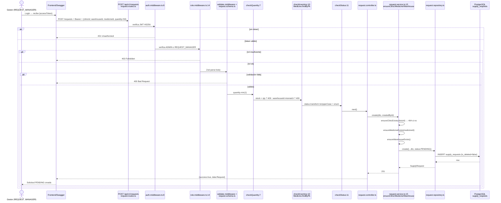
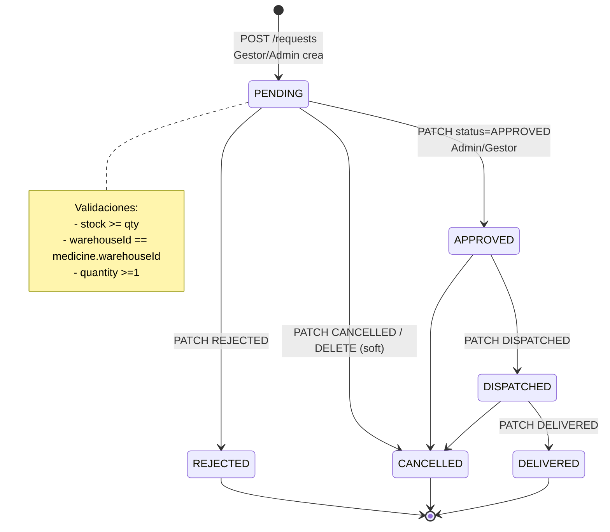

# Diagramas UML — RiwiMediCare Plus
### Norma 220501095 — Producto 2: Representaciones gráficas del funcionamiento del sistema
**Herramientas recomendadas:** Draw.io (diagrams.net), Lucidchart, StarUML. Exportar como PNG/SVG para el PDF.

Instrucciones: Copiar cada bloque Mermaid en https://mermaid.live o en Draw.io (Insert → Mermaid) y exportar. Todos los diagramas reflejan fielmente el código en `app/src/`.

---

## 1. Diagrama de Casos de Uso

**Actores:** Administrador (ADMIN), Gestor de Solicitudes (REQUEST_MANAGER), Invitado (no autenticado)

```mermaid
usecaseDiagram
  actor Invitado
  actor "Gestor Solicitudes" as Gestor
  actor Administrador as Admin

  Invitado --> (Registrarse)
  Invitado --> (Login)
  Invitado --> (Seed Upload JSON)

  Gestor --> (Crear Solicitud)
  Gestor --> (Cambiar Estado Solicitud)
  Gestor --> (Consultar Solicitudes)

  Admin --> (CRUD Clínicas)
  Admin --> (CRUD Almacenes)
  Admin --> (CRUD Medicamentos)
  Admin --> (CRUD Solicitudes)
  Admin --> (Eliminar Lógico)
  Admin --> (Consultar Solicitudes)

  (Crear Solicitud) ..> (Validar Inventario) : <<include>>
  (Crear Solicitud) ..> (Validar Cantidad >0) : <<include>>
  (Crear Solicitud) ..> (Validar Existencia Clínica/Medicina) : <<include>>
  (CRUD Clínicas) ..> (Validar NIT Duplicado) : <<include>>
  (Cambiar Estado Solicitud) ..> (Validar Estado ENUM) : <<include>>
```

**Descripción:** Invitado solo puede registrarse/loguearse. Autenticados vía `auth.middleware.ts:8` con `Bearer`. Rol verificado en `role.middleware.ts:14`. Gestor limitado a solicitudes. Admin tiene privilegio total.

---

## 2. Diagrama de Clases (Estructura de clases/componentes)

Refleja `src/models/*.model.ts`, `services/*.service.ts`, `repositories/*.repository.ts`, `controllers/*.controller.ts`, `middleware/*.ts`.

```mermaid
classDiagram
  class User {
    +id: number
    +name: string
    +email: string
    +password: string
    +role: UserRole
    +isDeleted: boolean
    +createdAt: Date
    +deletedAt: Date
  }
  class Clinic {
    +id: number
    +name: string
    +nit: string unique
    +address: string
    +phone: string
    +responsibleName: string
    +responsibleEmail: string
  }
  class Warehouse {
    +id: number
    +name: string
    +code: string unique
    +location: string
  }
  class Medicine {
    +id: number
    +warehouseId: number FK
    +name: string
    +code: string
    +stock: number
    +unitPrice: decimal
  }
  class SupplyRequest {
    +id: number
    +clinicId: number FK
    +warehouseId: number FK
    +medicineId: number FK
    +createdById: number FK
    +quantity: number
    +status: RequestStatus
    +notes: string
  }
  enum UserRole {
    ADMIN
    REQUEST_MANAGER
  }
  enum RequestStatus {
    PENDING
    APPROVED
    REJECTED
    DISPATCHED
    DELIVERED
    CANCELLED
  }

  User "1" -- "0..*" SupplyRequest : createdBy
  Clinic "1" -- "0..*" SupplyRequest
  Warehouse "1" -- "0..*" Medicine
  Warehouse "1" -- "0..*" SupplyRequest
  Medicine "1" -- "0..*" SupplyRequest

  class IClinicService {
    <<interface>> +create(dto)
    +findAll() +findById() +update() +delete()
  }
  class IMedicineService { <<interface>> }
  class IRequestService {
    <<interface>> +create() +updateStatus()
    +findAll() +findByClinic()
  }
  class ClinicService { -repo: IClinicRepo }
  class RequestService { -repo: IRequestRepo -ensureExists() }
  class ClinicRepository { +findByNit() }
  class RequestRepository { +create() }
  class ClinicController { +create(req,res) }
  class AuthService { +register() +login() }
  class JwtService { +sign() +verify() }

  IClinicService <|.. ClinicService
  IRequestService <|.. RequestService
  ClinicService --> ClinicRepository
  RequestService --> RequestRepository
  ClinicController --> ClinicService
  AuthService --> JwtService
  UserRole -- User
  RequestStatus -- SupplyRequest

  class AuthMiddleware { +verifyBearer() : 401 }
  class RoleMiddleware { +checkRole() : 403 }
  class CheckNitMiddleware { +409 if duplicate }
  class CheckInventoryMiddleware { +409 if stock<qty }
  class CheckQuantityMiddleware { +400 if qty<=0 }
```

**Notas:** Todos los models usan `paranoid:true`, `tableName` underscore, `timestamps`. Services implementan interfaces en `services/interfaces/`.

---

## 3. Diagrama de Secuencia — Crear Solicitud (Caso principal)

Flujo que evidencia `Interacción de los usuarios con el sistema` y `Flujo de procesos`.



**Variante PATCH /requests/:id/status:** mismo chain pero `checkStatus` valida ENUM case-insensitive (`approved`→`APPROVED`) y service verifica transición si se implementa.

---

## 4. Diagrama de Actividad — Flujo de Estados de Solicitud



En `request-status.enum.ts:1` están exactamente esos 6 estados; `checkStatus.middleware.ts:11` + `request.schema.ts:27` hacen `transform(v=>v.toUpperCase())`.

---

## 5. Diagrama de Actividad — Seed Inicial (Sin JWT)

```mermaid
flowchart TD
  A[Admin despliega app<br/>docker-compose up] --> B[POST /api/v1/seed/upload<br/>multipart file seed-real.json<br/>Sin Auth]
  B --> C{Multer memoryStorage<br/>fileFilter .json 5MB?}
  C -- No --> D[400 Invalid file]
  C -- Sí --> E[seed.service.ts<br/>sequelize.transaction]
  E --> F[BulkCreate Warehouses]
  F --> G[BulkCreate Clinics<br/>check NIT unique]
  G --> H[BulkCreate Medicines<br/>con warehouseId]
  H --> I[Hash bcrypt passwords<br/>hooks beforeCreate]
  I --> J[Commit]
  J --> K[200 {users:3, clinics:3, warehouses:2, medicines:4}]
  D --> Z[Fin]
  K --> Z
```

Archivo `seed-real.json` probado con 3 users (Admin/Gestor), 3 clinics, 2 warehouses, 4 medicines.

---

## Exportación

1. En **Draw.io**: File → New → Advanced → Mermaid → pegar código → Arrange → Export as PNG (300dpi).
2. En **StarUML**: Model → Add Diagram → seleccionar tipo → reproducir clases/atributos.
3. Incluir los 4 diagramas en el PDF del producto 2, con título, numeración y descripción bajo cada figura.

Si usas **Lucidchart**: Import Mermaid via Plugins.

**Checklist Norma para este producto:**
- [x] Interacción usuarios-sistema (casos de uso + secuencia)
- [x] Flujo de procesos (actividad/estados + seed)
- [x] Estructura de clases/componentes (diagrama de clases)

