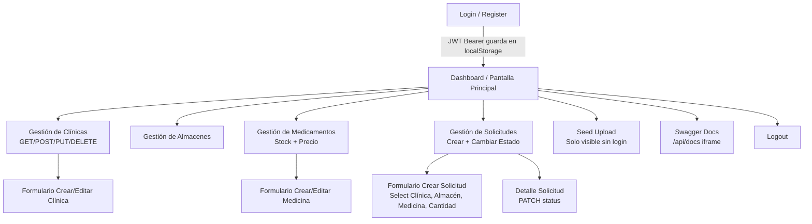

# Prototipo de Solución — RiwiMediCare Plus
### Norma 220501095 — Producto 3: Representación visual de cómo se verá el sistema para el usuario
**Herramientas válidas según norma:** Figma, Balsamiq, Draw.io o Canva. Este documento describe wireframes/mockups listos para prototipar en cualquiera.

**Contexto:** Aunque el entregable real es API REST (sin frontend), se prototipa un **Frontend Admin Panel** en `http://localhost:5173` (FRONTEND_URL) que consumiría la API. Esto satisface la norma de “Diseño de interfaces, Navegación entre pantallas, Experiencia de usuario”.

---

## 1. Mapa de Navegación (Sitemap)



**Roles:** Admin ve todo. Gestor solo ve Solicitudes + Dashboard lectura. Invitado solo ve Login/Register/Seed.

---

## 2. Wireframes / Mockups

### 2.1 Pantalla Principal — Dashboard

```
+------------------------------------------------------------------+
| RiwiMediCare+  [Dashboard][Clínicas][Almacenes][Medicinas][Solicitudes]  [Admin@] [Logout] |
+------------------------------------------------------------------+
| Bienvenido, Admin RiwiMediCare (ADMIN)                           |
| Resumen: 3 Clínicas | 2 Almacenes | 4 Medicamentos | 1 Solicitud Activa |
+------------------------------------------------------------------+
| [ Tarjetas KPI ]                                                 |
| ┌─────────────┐ ┌─────────────┐ ┌─────────────┐ ┌─────────────┐ |
| | Clínicas 3  | | Almacenes 2 | | Medicinas 4 | | Pendientes 1| |
| | Ver →       | | Ver →       | | Stock bajo 1| | Gestionar → | |
| └─────────────┘ └─────────────┘ └─────────────┘ └─────────────┘ |
| Solicitudes recientes (GET /requests/active)                     |
| | ID | Clínica | Medicina | Cant | Estado   | Acción           | |
| | 1  | Central | Paracetamol | 50 | PENDING | [Ver][Aprobar] | |
+------------------------------------------------------------------+
| Footer: API Docs | Backup.sql | © 2026 Riwi                           |
+------------------------------------------------------------------+
```

**UX:** Cards con estado color (PENDING amarillo, APPROVED verde, REJECTED rojo). Filtros por estado y clínica.

### 2.2 Gestión de Proyectos (adaptado a Gestión de Solicitudes)

```
+------------------------------------------------------------------+
| Gestión de Solicitudes            [+ Nueva Solicitud]  [Filtro: PENDING ▼] |
+------------------------------------------------------------------+
| Tabla (GET /api/v1/requests)                                     |
| ID | Clínica | Almacén | Medicina | Cant | Estado    | CreadoPor | Acciones |
| 1  | Clínica Central (900123456) | Bodega Central | Paracetamol 500mg | 50 | PENDING | gestor@... | [Detalle][Cambiar Estado▼][Eliminar] |
| 2  | Clínica Norte | Bodega Norte | Ibuprofeno | 20 | APPROVED | admin@... | ... |
+------------------------------------------------------------------+
| Paginación • Búsqueda por clínica/medicina • Export CSV          |
+------------------------------------------------------------------+
```

**Navegación:** Click en fila → Detalle. Botón “Cambiar Estado” abre modal con select ENUM (case-insensitive, muestra mayúsculas).

### 2.3 Gestión de Tareas → Gestión de Clínicas/Almacenes/Medicinas

**Clínicas:**
```
+------------------------------------------------------------------+
| Gestión de Clínicas               [+ Nueva Clínica]              |
| NIT | Nombre | Dirección | Tel | Responsable | isDeleted | Acciones |
| 900123456-10 | Clínica Central | Cra 15 #85-20 | 300... | Laura Méndez | No | [Editar][Eliminar lógico] |
+------------------------------------------------------------------+
```

**Almacenes:**
```
| Code | Nombre | Ubicación | Acciones |
| BOG-001 | Bodega Central | Bogotá Fontibón Calle 17 #69-02 | [Editar][Eliminar] |
```

**Medicamentos:**
```
| Code | Nombre | Stock | Precio | Almacén | Acciones |
| MED-001 | Paracetamol 500mg | 120 | $2500.50 | Bodega Central (1) | [Editar][Eliminar] |
| MED-002 | Ibuprofeno 400mg | 15 ⚠️ bajo | $3200 | Bodega Norte (2) | ... |
```

### 2.4 Formularios de Creación/Edición

**Formulario Crear Solicitud (POST /requests) — Validaciones visibles:**
```
+------------------------------------------------------------------+
| Nueva Solicitud de Abastecimiento                    [ X Cerrar] |
|------------------------------------------------------------------|
| Clínica * [ Select Clínica ▼ | Clínica Central (900123456) ]   |
| Almacén * [ Select Almacén ▼ | Bodega Central (BOG-001) ]      |
| Medicina * [ Select Medicina ▼ | Paracetamol 500mg (stock:120) ]|
|   ↳ Si medicina pertenece a otro almacén → error 409 inline:    |
|   “La medicina no pertenece al almacén seleccionado”            |
| Cantidad * [ 50 ]  ← checkQuantity: cantidad >0, si no 400      |
|   ↳ Si stock < qty → error 409: “Stock insuficiente (120 < 500)” |
| Notas    [ Textarea: Entrega urgente ... ]                       |
| Estado   (auto PENDING, no editable al crear)                    |
| [Cancelar] [ Crear Solicitud ]                                   |
| Validación: checkInventory (Medicine.findByPk) en tiempo real   |
+------------------------------------------------------------------+
```

**Formulario Clínica (con validación NIT duplicado 409):**
```
| Nombre * [ Clínica Central ] |
| NIT * [ 900123456-10 ]  ← onBlur valida 409 |
| Dirección * [ Cra 15 ... ] |
| Teléfono * [ +57 300 4567890 ] |
| Responsable * [ Laura Méndez ] |
| Email Responsable * [ laura@clinic.com ] |
| [ Guardar ] |
```

**Formulario Medicina:**
```
| Nombre * [ Paracetamol 500mg ] |
| Código * [ MED-001 ] |
| Descripción [ Analgésico ] |
| Stock * [ 120 ] |
| Precio Unitario * [ 2500.50 ] |
| Almacén * [ Bodega Central ▼ ] |
```

### 2.5 Login / Register / Seed

**Login (POST /auth/login):**
```
+-----------------------------------+
| RiwiMediCare Plus — Iniciar Sesión|
| Email [ admin@riwimedicare.com ]  |
| Password [ •••••• ]               |
| [ Ingresar ]  ¿No tienes cuenta? Regístrate |
| Error 401 si credenciales inválidas |
+-----------------------------------+
```

**Seed Upload (POST /seed/upload sin JWT):**
```
+------------------------------------------------+
| Carga Inicial (Primer Deploy)                  |
| Arrastra seed-real.json o [ Examinar ] 5MB max |
| Solo .json | Contiene users, warehouses, clinics, medicines |
| [ Subir Seed ] → {users:3, clinics:3, warehouses:2, medicines:4} |
+------------------------------------------------+
```

---

## 3. Experiencia de Usuario (UX) — Principios

| Principio | Aplicación en prototipo |
|-----------|-------------------------|
| **Consistencia** | Header fijo, paleta azul salud (#0E6BA8) + verde éxito, tipografía Inter, botones primarios sólidos, secundarios outline |
| **Prevención de errores** | Validación inline Zod (400), inline 409 para NIT/code duplicado, deshabilitar botón si stock insuficiente, confirm modal para DELETE lógico |
| **Feedback** | Toasts: “Clínica creada 201”, “Stock insuficiente 409”, “Sesión expirada 401”. Skeletons al cargar tabla. Badge de estado con color. |
| **Eficiencia** | Selects con búsqueda, atajos teclado (Ctrl+N nueva solicitud), tabla con sort/filter sin recarga, localStorage para JWT |
| **Accesibilidad** | Contraste AA, labels asociados, aria-live para errores, tab order lógico, responsive mobile-first (Balsamiq wireframe mobile) |
| **Seguridad visible** | Mostrar rol en header, ocultar botones según rol (Gestor no ve “Eliminar Clínica”), logout limpia token, Helmet/CORS explicado en tooltip |

**Flujo feliz Gestor:** Login → Dashboard → Solicitudes → +Nueva Solicitud → seleccionar clínica/almacén/medicina → ver stock en tiempo real → poner cantidad válida → crear → ver toast 201 → ver nueva fila PENDING amarilla → PATCH a APPROVED → badge verde.

**Flujo error:** Intentar crear con cantidad 0 → inline 400 “Quantity must be >=1”. Intentar medicina de otra bodega → 409 inline. Intentar borrar siendo Gestor → 403.

---

## 4. Prototipo Interactivo — Cómo construirlo en Figma/Balsamiq/Draw.io

1. **En Figma:** Crear Frame 1440x900 (Desktop) + 375x812 (Mobile). Usar componentes: Header, Card, Table, Form, Modal. Crear Prototype links: Dashboard → Gestión → Formulario → Tabla (con animación Smart Animate). Compartir link “View only”.
2. **En Balsamiq:** Usar UI Library → Header Bar, Data Grid, ComboBox, Text Input. Exportar a PDF.
3. **En Draw.io:** Usar librería Mockups → Wireframe. Exportar PNG para anexar a este documento.
4. Incluir en entrega: URL de Figma público + PDF de wireframes + video 1min de navegación (opcional pero suma).

**Entregable para la norma:** PDF con portada + índice + 5 wireframes (Principal, Solicitudes, Clínicas/Medicinas, Formularios, Login/Seed) + mapa de navegación + tabla UX.

