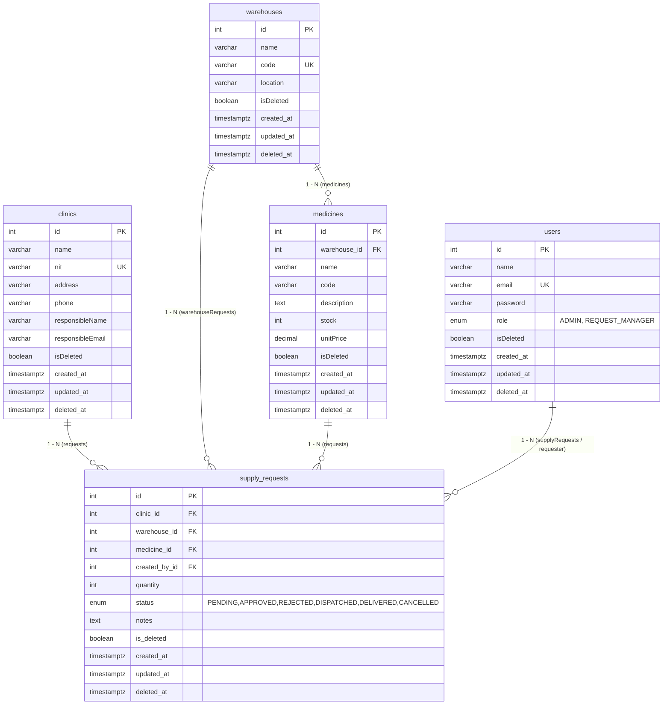

# Modelo de Base de Datos — RiwiMediCare Plus
### Norma 220501095 — Producto 4: Diseño de cómo se almacenará la información del sistema
**Motor:** PostgreSQL 15-alpine | **ORM:** Sequelize 6 (`paranoid:true`, `underscored:true`, `timestamps:true`) | **Backup:** `backup.sql` (pg_dump --clean --if-exists)

---

## 1. Identificación de Entidades

| Entidad | Descripción | Tabla | PK | Atributos principales | Volumen estimado |
|---------|-------------|-------|----|-----------------------|------------------|
| **User** | Usuarios del sistema con rol | `users` | `id` SERIAL | name, email unique, password hash, role ENUM, isDeleted, createdAt, updatedAt, deletedAt | 10-100 |
| **Clinic** | Clínicas solicitantes | `clinics` | `id` SERIAL | name, nit unique, address, phone, responsibleName, responsibleEmail, isDeleted | 3-500 |
| **Warehouse** | Almacenes/Bodegas proveedoras | `warehouses` | `id` SERIAL | name, code unique, location, isDeleted | 2-50 |
| **Medicine** | Medicamentos con stock por almacén | `medicines` | `id` SERIAL | warehouse_id FK, name, code, description TEXT, stock INT, unitPrice DECIMAL(10,2), isDeleted | 4-10k |
| **SupplyRequest** | Solicitudes de abastecimiento | `supply_requests` | `id` SERIAL | clinic_id FK, warehouse_id FK, medicine_id FK, created_by_id FK, quantity INT, status ENUM, notes TEXT, isDeleted | 1-100k |

Todas las entidades tienen `isDeleted BOOLEAN default false` + `deleted_at TIMESTAMPTZ` para borrado lógico (`paranoid:true` en `src/config/database.ts`).

## 2. Diagrama Entidad-Relación (ER) — Mermaid



**Cardinalidades (según `src/models/index.ts`):**
- `Clinic.hasMany(Request, {foreignKey: clinicId, as: requests})` → `Request.belongsTo(Clinic)`
- `Warehouse.hasMany(Medicine)` → `Medicine.belongsTo(Warehouse)`
- `Warehouse.hasMany(Request, as: warehouseRequests)`
- `Medicine.hasMany(Request)` → `Request.belongsTo(Medicine)`
- `User.hasMany(Request, foreignKey: createdById, as: supplyRequests)` → `Request.belongsTo(User, as: requester)`

## 3. Modelo Relacional — Detalle de Tablas, Campos y Tipos

### 3.1 `users`
| Campo | Tipo | Constraints | Descripción |
|-------|------|-------------|-------------|
| id | INTEGER SERIAL | PK, autoIncrement | Identificador |
| name | VARCHAR(150) | NOT NULL | Nombre completo |
| email | VARCHAR(150) | NOT NULL, UNIQUE, isEmail | Login |
| password | VARCHAR(255) | NOT NULL | Hash bcryptjs (12 rounds) |
| role | ENUM('ADMIN','REQUEST_MANAGER') | NOT NULL, default REQUEST_MANAGER | `src/constants/roles.enum.ts` |
| isDeleted | BOOLEAN | NOT NULL, default false | Borrado lógico flag |
| createdAt | TIMESTAMPTZ | NOT NULL, auto | `timestamps:true` |
| updatedAt | TIMESTAMPTZ | NOT NULL, auto | |
| deletedAt | TIMESTAMPTZ | NULL | `paranoid:true` |

Hooks: `beforeDestroy` set isDeleted=true.

### 3.2 `clinics`
| Campo | Tipo | Constraints |
|-------|------|-------------|
| id | INTEGER | PK |
| name | VARCHAR(150) | NOT NULL |
| nit | VARCHAR(50) | NOT NULL, UNIQUE (validado por checkNit.middleware.ts:7, 409 si duplicado excluyendo id propio en PUT) |
| address | VARCHAR(255) | NOT NULL |
| phone | VARCHAR(30) | NOT NULL |
| responsibleName | VARCHAR(150) | NOT NULL |
| responsibleEmail | VARCHAR(150) | NOT NULL, isEmail |
| isDeleted, createdAt, updatedAt, deletedAt | — | como users |

### 3.3 `warehouses`
| Campo | Tipo | Constraints |
|-------|------|-------------|
| id | INTEGER | PK |
| name | VARCHAR(150) | NOT NULL |
| code | VARCHAR(50) | NOT NULL, UNIQUE (ej: BOG-001) |
| location | VARCHAR(255) | NOT NULL (ej: Bogotá D.C. - Fontibón) |

### 3.4 `medicines`
| Campo | Tipo | Constraints |
|-------|------|-------------|
| id | INTEGER | PK |
| warehouse_id | INTEGER | FK → warehouses.id, NOT NULL, field: warehouse_id (underscored), REFERENCES warehouses(id) |
| name | VARCHAR(150) | NOT NULL (ej: Paracetamol 500mg) |
| code | VARCHAR(50) | NOT NULL (ej: MED-001) |
| description | TEXT | NULL (ej: Analgésico) |
| stock | INTEGER | NOT NULL, default 0, min 0 |
| unitPrice | DECIMAL(10,2) | NOT NULL, min 0 (ej: 2500.50) |
| isDeleted, timestamps | — | |

Índice implícito en warehouse_id para JOIN.

### 3.5 `supply_requests` (tabla central)
| Campo | Tipo | Constraints |
|-------|------|-------------|
| id | INTEGER | PK |
| clinic_id | INTEGER | FK → clinics.id, NOT NULL, field: clinic_id |
| warehouse_id | INTEGER | FK → warehouses.id, NOT NULL |
| medicine_id | INTEGER | FK → medicines.id, NOT NULL |
| created_by_id | INTEGER | FK → users.id, NOT NULL, field: created_by_id |
| quantity | INTEGER | NOT NULL, min 1 (validado Zod `z.coerce.number().min(1)` + checkQuantity.middleware.ts:7 → 400) |
| status | ENUM('PENDING','APPROVED','REJECTED','DISPATCHED','DELIVERED','CANCELLED') | NOT NULL, default PENDING, case-insensitive via `transform toUpperCase` (checkStatus.middleware.ts:11) |
| notes | TEXT | NULL |
| is_deleted | BOOLEAN | NOT NULL, default false, field: is_deleted |
| created_at, updated_at, deleted_at | TIMESTAMPTZ | paranoid |

**Reglas de negocio a nivel BD + App:**
- `stock < quantity` o `medicine.warehouse_id != request.warehouse_id` → 409 en `checkInventory.middleware.ts:10` (app), no constraint BD pero validado antes de INSERT.
- Status solo ENUM → 400 si otro valor.
- FKs con `ON DELETE RESTRICT` (no borrar clinic/warehouse con requests activas; se usa soft delete).

## 4. Llaves Primarias y Foráneas

| Tabla | PK | FK | Referencia | ON DELETE | Índice |
|-------|----|----|------------|-----------|--------|
| users | id | — | — | — | UNIQUE(email) |
| clinics | id | — | — | RESTRICT | UNIQUE(nit) |
| warehouses | id | — | — | RESTRICT | UNIQUE(code) |
| medicines | id | warehouse_id | warehouses.id | RESTRICT | INDEX(warehouse_id) |
| supply_requests | id | clinic_id | clinics.id | RESTRICT | INDEX(clinic_id) |
|  |  | warehouse_id | warehouses.id | RESTRICT | INDEX(warehouse_id) |
|  |  | medicine_id | medicines.id | RESTRICT | INDEX(medicine_id) |
|  |  | created_by_id | users.id | RESTRICT | INDEX(created_by_id) |

Todas las FK son `INTEGER` con `allowNull:false`. Sequelize define `field: 'clinic_id'` etc. para `underscored:true`.

## 5. Relaciones entre Entidades (Texto + Cardinalidad)

1. **Clinic — SupplyRequest:** 1 clínica tiene 0..N solicitudes (`hasMany`). Cada solicitud pertenece a 1 clínica obligatoria.
2. **Warehouse — Medicine:** 1 almacén almacena 0..N medicamentos. Cada medicamento está en exactamente 1 almacén.
3. **Warehouse — SupplyRequest:** 1 almacén atiende 0..N solicitudes. Cada solicitud especifica 1 almacén origen.
4. **Medicine — SupplyRequest:** 1 medicamento puede estar en 0..N solicitudes. Cada solicitud pide 1 medicamento.
5. **User — SupplyRequest:** 1 usuario (ADMIN/GESTOR) crea 0..N solicitudes (`createdById`). Cada solicitud tiene 1 creador.

No hay relaciones N:M; el modelo es estrella con `supply_requests` como hecho.

## 6. Script DDL (extracto de `backup.sql` y Sequelize sync)

Se puede generar vía `sequelize.sync({alter:true})` en `src/index.ts`. Extracto pg_dump:

```sql
CREATE TABLE users (
  id SERIAL PRIMARY KEY,
  name VARCHAR(150) NOT NULL,
  email VARCHAR(150) NOT NULL UNIQUE,
  password VARCHAR(255) NOT NULL,
  role VARCHAR(255) CHECK (role IN ('ADMIN','REQUEST_MANAGER')),
  is_deleted BOOLEAN NOT NULL DEFAULT false,
  created_at TIMESTAMPTZ NOT NULL DEFAULT NOW(),
  updated_at TIMESTAMPTZ NOT NULL DEFAULT NOW(),
  deleted_at TIMESTAMPTZ
);
-- Similar para clinics, warehouses, medicines, supply_requests
-- Ver backup.sql completo (123K) en raíz del proyecto
```

Restaurar: `docker exec -i app-db psql -U nodejs -d app_db < backup.sql`

## 7. Consideraciones No Funcionales de BD

- **Normalización:** 3FN (sin redundancia; precio y stock solo en medicines).
- **Integridad:** UNIQUE en email/nit/code, ENUM para role/status, FKs NOT NULL.
- **Auditoría:** timestamps + paranoid + isDeleted permiten recuperar borrados y trazabilidad.
- **Performance:** Índices en FKs y UNIQUE para búsquedas O(log n). Paginación a futuro.
- **Backup:** `backup.sql` incluye --clean --if-exists, datos de prueba (4 users, 3 clinics, 2 warehouses, 4 medicines, 1 request).

---

**Cómo entregar este producto:** Exportar este Markdown + diagrama ER (Mermaid → PNG en Draw.io) a PDF. Incluir captura de `backup.sql` y de DBeaver/pgAdmin con el ER. Subir al formulario.
**Formulario:** https://forms.gle/xtd48BgaPFEHzRAJ7
